# Mã Sơ Đồ Báo Cáo (Mermaid)

Các sơ đồ dưới đây đã được căn theo mô tả bảng trong tài liệu TRƯỜNG ĐẠI HỌC.docx (bản trích xuất `TRUONG_DAI_HOC_extracted.txt`), đặc biệt ở các mục 3.2, 3.3, 3.4, 4.1, 4.2, 4.3, 4.4 và 4.8.

## Giải Thích Chi Tiết Mục 2.4 (Phân Tán CSDL)

### 1) Phân mảnh dữ liệu (Fragmentation)
- Hệ thống phân mảnh theo chiều dọc theo domain nghiệp vụ, không phải chia ngang theo bản ghi.
- DB1_NHANSU chỉ lưu dữ liệu nhân sự và tổ chức: NhanVien, PhongBan, ChucVu.
- DB2_LUONG chỉ lưu dữ liệu tiền lương: BangLuong, ChiTietLuongThang, BaoHiemConfig, LichSuThayDoiLuong, HopDongLuong.
- Liên kết logic giữa hai DB đi qua khóa NhanVienID (không dùng foreign key vật lý liên database trong MySQL).

### 2) Tính trong suốt dữ liệu (Transparency)
- Người dùng và frontend không truy vấn trực tiếp từng DB; chỉ gọi API.
- Backend thực hiện "hợp nhất dữ liệu" theo 2 cách:
  - Cách 1: View cross-DB (ví dụ vw_AdminNhanVienDayDu) để đọc dữ liệu tổng hợp một lần.
  - Cách 2: API merge (đọc DB1 và DB2 riêng, ghép theo NhanVienID rồi trả về một JSON duy nhất).
- Vì vậy, UI chỉ thấy một mô hình dữ liệu thống nhất, không cần biết bản ghi đến từ DB1 hay DB2.

### 3) Đồng bộ thao tác (Consistency/Sync)
- Với các nghiệp vụ chạm cả 2 DB (thêm nhân viên, xóa mềm nhân viên), backend coi đây là một đơn vị công việc logic.
- Luồng thêm nhân viên:
  - B1: Insert NhanVien vào DB1_NHANSU.
  - B2: Insert BangLuong mặc định vào DB2_LUONG.
  - B3: Nếu cả hai thành công thì commit; nếu một bước lỗi thì rollback để tránh lệch dữ liệu.
- Luồng xóa mềm:
  - B1: Update NhanVien.TrangThai = 0 ở DB1.
  - B2: Update BangLuong.TrangThai = 0 ở DB2.
  - B3: Ghi nhận lịch sử thay đổi lương và hoàn tất giao dịch.
- Mục tiêu là đảm bảo: không có trường hợp nhân viên tồn tại ở DB1 nhưng thiếu hồ sơ lương ở DB2 (hoặc ngược lại ở trạng thái hoạt động).

### 4) Phân quyền (Authorization)
- Bảo mật theo 2 lớp:
  - Lớp API: JWT + kiểm tra role trước khi xử lý nghiệp vụ.
  - Lớp dữ liệu: quyền truy cập bảng/DB theo vai trò nghiệp vụ.
- Admin chủ yếu quản trị dữ liệu nhân sự và xem báo cáo tổng hợp.
- Kế toán tập trung thao tác dữ liệu lương.
- Nhân viên chỉ được xem dữ liệu của chính mình (lọc theo user_id trong token).

### 5) Hai DB "giao tiếp" với nhau như thế nào trong thực tế?
- Hai DB không gọi trực tiếp nhau như service-to-service; chúng được điều phối bởi backend Flask.
- Backend đóng vai trò "orchestrator":
  - Điều phối ghi nhiều bước giữa DB1 và DB2.
  - Gom dữ liệu từ nhiều nguồn thành một response thống nhất.
  - Áp dụng rule nghiệp vụ và rule phân quyền trước khi trả dữ liệu.
- Ngoài backend, một số truy vấn đọc có thể dùng view cross-DB để tăng tính trong suốt khi báo cáo.

### 6) Luồng tương tác chuẩn giữa 2 DB
- Luồng ghi (write path): Frontend -> API -> DB1 + DB2 -> commit/rollback -> API response.
- Luồng đọc (read path): Frontend -> API -> (DB1, DB2 hoặc view cross-DB) -> merge -> JSON trả về UI.

## 1) Kiến Trúc Tổng Thể Hệ Thống (3 Lớp)
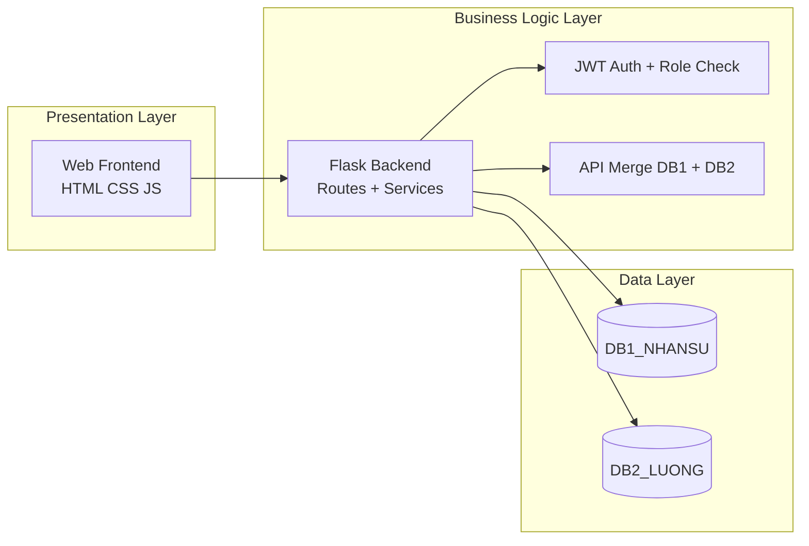

## 2) Phân Mảnh Dọc Dữ Liệu (Vertical Fragmentation)
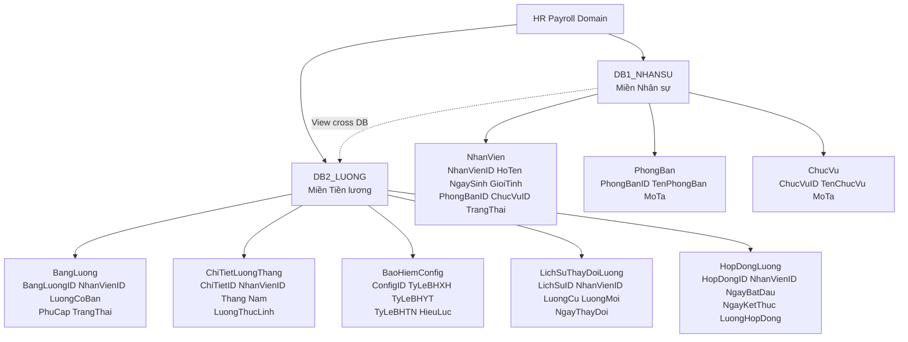

## 3) Use Case Tổng Hợp Theo Vai Trò
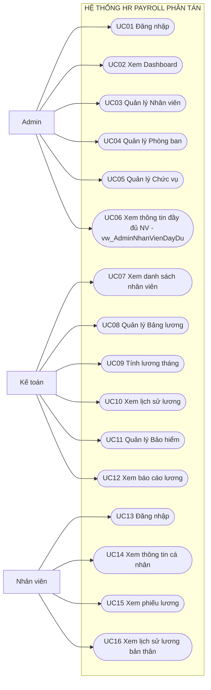

## 4) Sequence - Đăng Nhập + JWT (3.4.1)
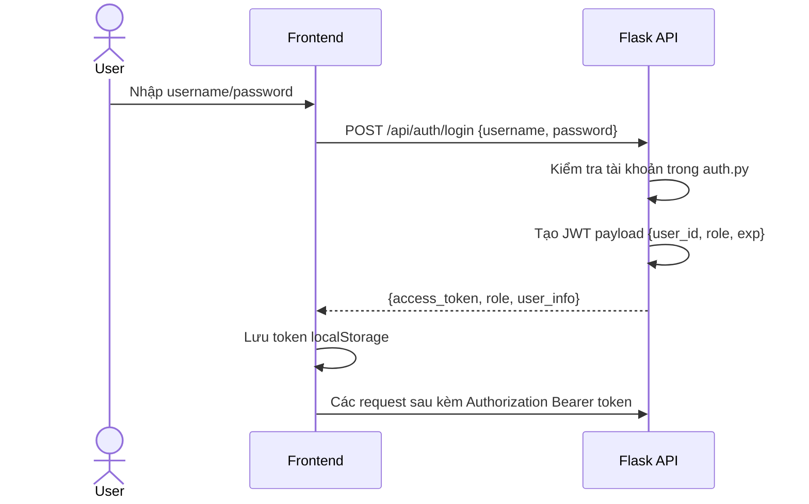

## 5) Sequence - Thêm Nhân Viên + Tạo Bảng Lương (3.4.2)
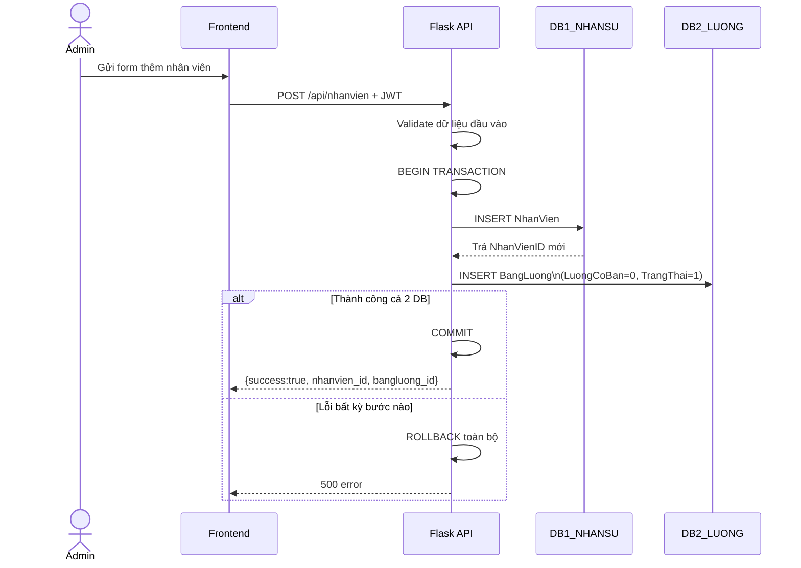

## 6) Sequence - Tính Lương Tháng + Dashboard (3.4.3)
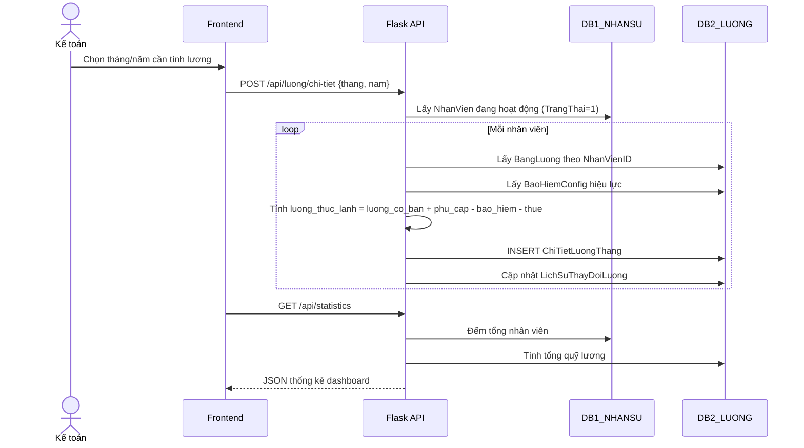

## 7) Activity - UC03 Thêm Nhân Viên Mới
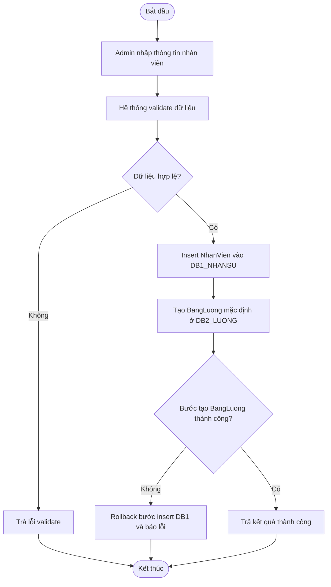

## 8) Activity - UC09 Tính Lương Tháng
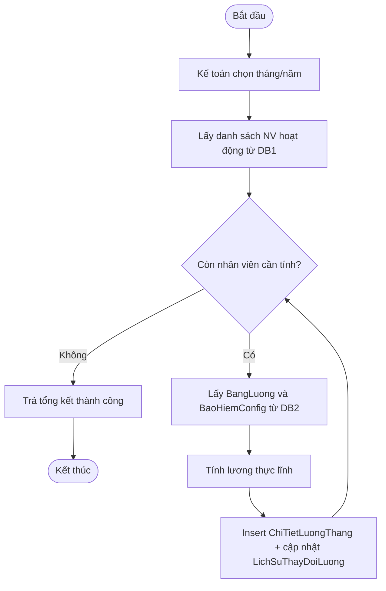

## 9) ER Diagram Theo Bảng Mô Tả (4.2)
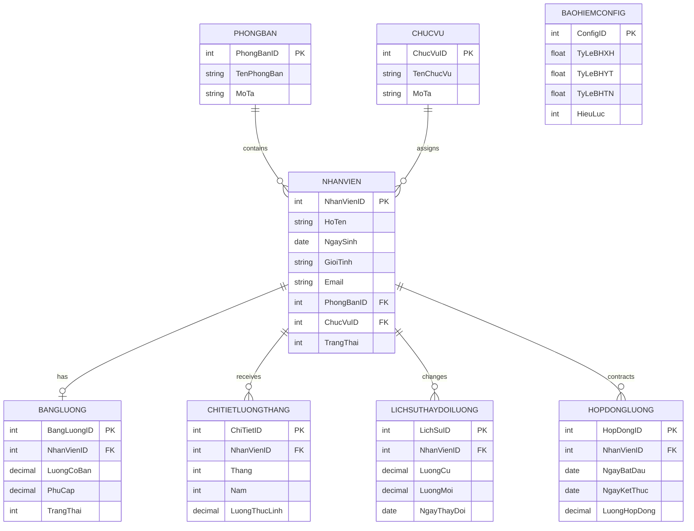

## 10) Tính Trong Suốt Dữ Liệu (View + API Merge) (4.3)
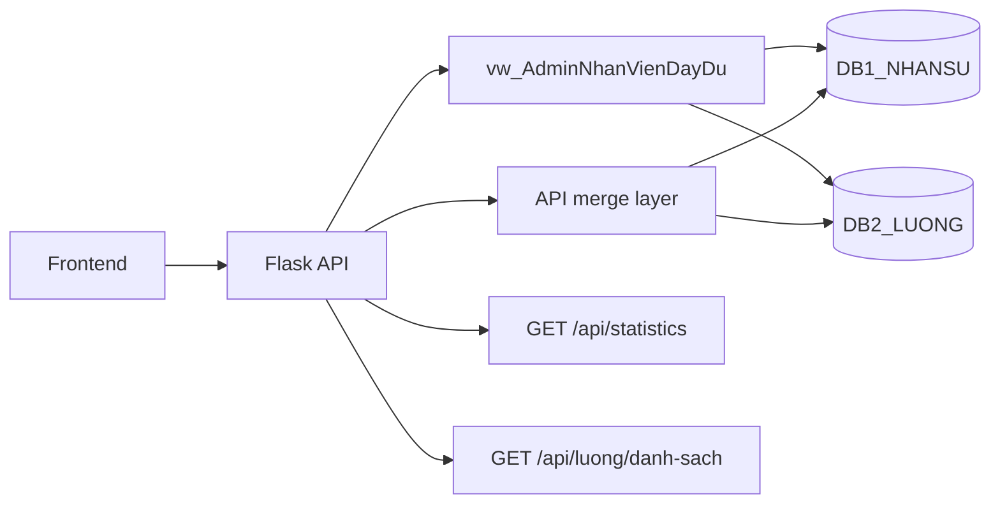

## 11) Use Case Chi Tiết - Admin (3.2.1)
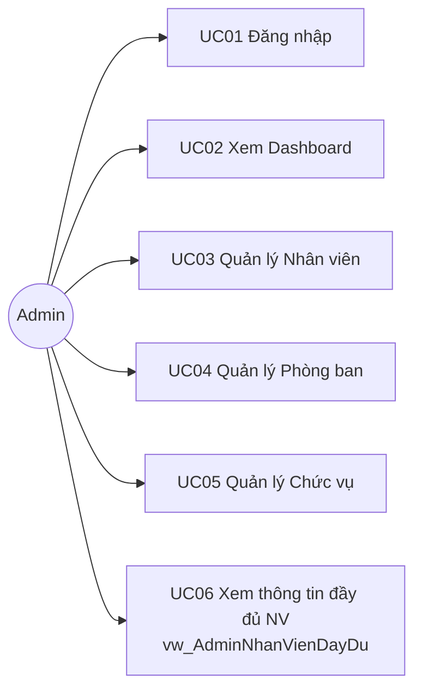

## 12) Use Case Chi Tiết - Kế Toán (3.2.2)
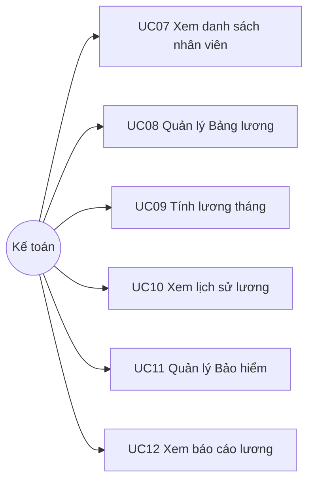

## 13) Use Case Chi Tiết - Nhân Viên (3.2.3)
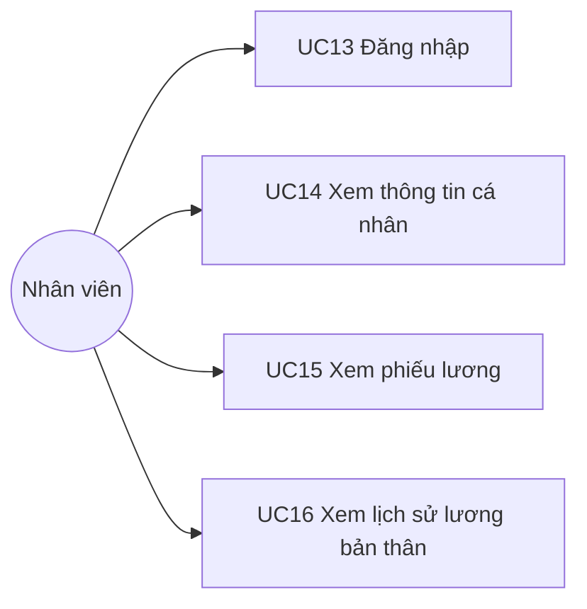

## 14) Sequence - Xem Chi Tiết Lương + Role Guard
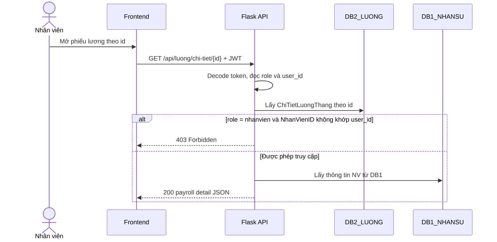

## 15) Activity - Xóa Mềm Nhân Viên Đồng Bộ (4.4.2)
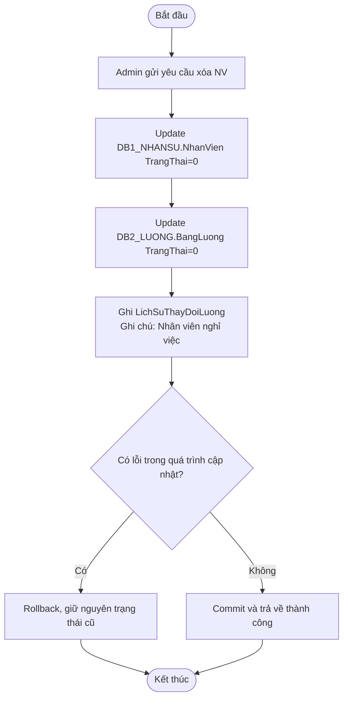

## 16) Luồng Điều Hướng Frontend -> Backend (4.8)
```mermaid
flowchart TD
  L[Trang đăng nhập] -->|POST /api/auth/login| D[Dashboard]

  D --> M1[Danh sách nhân viên]
  D --> M2[Chi tiết nhân viên]
  D --> M3[Bảng lương]
  D --> M4[Phiếu lương]
  D --> M5[Thống kê]

  M1 -->|API| A1[/api/nhanvien]
  M2 -->|API| A2[/api/nhanvien/{id}]
  M3 -->|API| A3[/api/luong/danh-sach]
  M4 -->|API| A4[/api/luong/chi-tiet]
  M5 -->|API| A5[/api/statistics]

  D -->|Đăng xuất| L
```

## Gợi Ý Vị Trí Đặt Trong Báo Cáo
1. Hình 1 (Kiến trúc tổng thể 3 lớp) -> Chương 4.1
2. Hình 2 (Phân mảnh dọc dữ liệu) -> Chương 4.2
3. Hình 3 (Use Case tổng hợp theo vai trò) -> Chương 3.2
4. Hình 4 (Sequence Đăng nhập + JWT) -> Chương 3.4.1
5. Hình 5 (Sequence Thêm nhân viên + Tạo bảng lương) -> Chương 3.4.2
6. Hình 6 (Sequence Tính lương tháng + Dashboard) -> Chương 3.4.3
7. Hình 7 (Activity UC03 Thêm nhân viên) -> Chương 3.3
8. Hình 8 (Activity UC09 Tính lương tháng) -> Chương 3.3
9. Hình 9 (ER Diagram theo bảng mô tả) -> Chương 4.2
10. Hình 10 (Tính trong suốt dữ liệu) -> Chương 4.3
11. Hình 11 (Use Case chi tiết Admin) -> Chương 3.2.1
12. Hình 12 (Use Case chi tiết Kế toán) -> Chương 3.2.2
13. Hình 13 (Use Case chi tiết Nhân viên) -> Chương 3.2.3
14. Hình 14 (Sequence Xem chi tiết lương + Role Guard) -> Chương 3.4.4 (bổ sung)
15. Hình 15 (Activity Xóa mềm đồng bộ) -> Chương 4.4.2
16. Hình 16 (Luồng Frontend -> Backend) -> Chương 4.8
